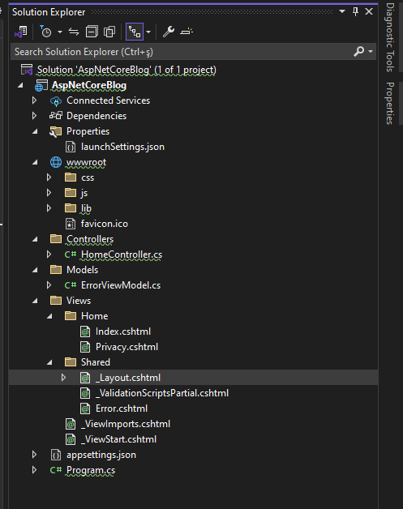
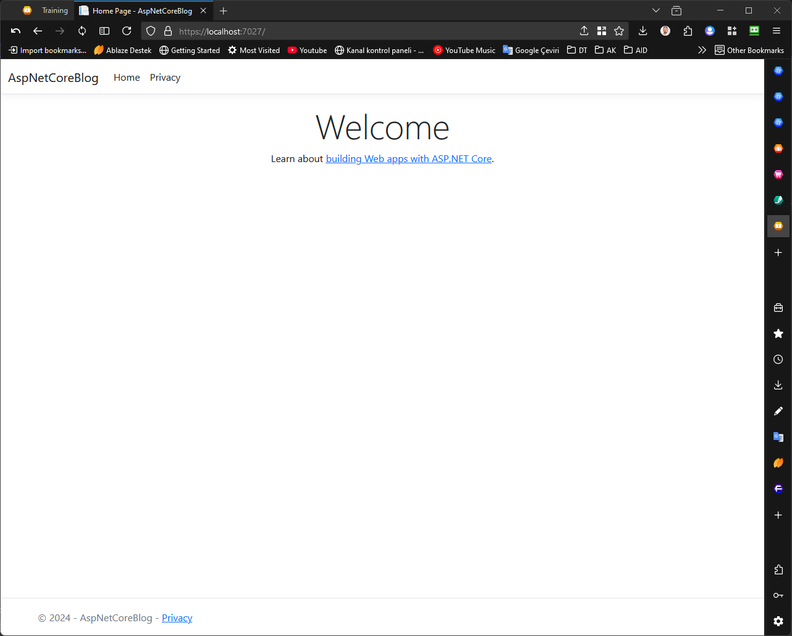

# 1. Giriş ve Temel Kavramlar

Merhaba ve "Asp.Net Core MVC ile Web Programlama" eğitimine hoş geldiniz! Bu eğitimde, modern web uygulamaları geliştirmek için kullanılan güçlü bir çerçeve olan Asp.Net Core MVC'yi tanıyacak ve temellerini öğreneceğiz. Günümüzde web teknolojileri, hızla gelişen dijital dünyada iletişim, ticaret ve bilgi paylaşımının temel taşıdır. Bu nedenle, web programlama becerileri hem profesyonel kariyerinizde hem de öğrencilerinize daha iyi rehberlik edebilmeniz için büyük bir avantaj sağlayacaktır.

Asp.Net Core MVC, Microsoft tarafından sunulan ve web uygulamaları geliştirmeyi kolaylaştıran açık kaynaklı bir platformdur. Platformun "MVC" (Model-View-Controller) mimarisi, uygulama geliştirme sürecinde düzen ve esneklik sağlayarak kodunuzu daha temiz, anlaşılır ve sürdürülebilir hale getirir.

Eğitimimizin bu ilk bölümünde, Asp.Net Core MVC'nin ne olduğunu, MVC mimarisinin nasıl çalıştığını ve bu mimarinin bileşenlerini detaylı bir şekilde ele alacağız. Ayrıca, bir Asp.Net Core MVC projesinin yapısını ve dosya organizasyonunu inceleyerek temelleri sağlam bir şekilde oturtacağız. Bu bilgiler, ilerleyen aşamalarda uygulama geliştirme sürecinizi kolaylaştıracak bir yol haritası oluşturmanıza yardımcı olacaktır.

Bu başlangıç, yalnızca teknik kavramları öğrenmekle kalmayıp aynı zamanda Asp.Net Core MVC'nin sağladığı avantajları ve gerçek dünya uygulamalarında nasıl kullanıldığını anlamak için bir temel oluşturacak. Hazırsanız, bu yolculuğa birlikte çıkalım ve Asp.Net Core MVC'nin kapılarını aralayalım!


## 1.1. Asp.Net Core MVC nedir?

### Asp.Net Core MVC’ye Genel Bakış

**Asp.Net Core MVC**, Microsoft tarafından geliştirilen, web uygulamaları oluşturmak için kullanılan açık kaynaklı ve platformlar arası (cross-platform) bir framework’tür. MVC (Model-View-Controller) mimarisini temel alır ve modern web uygulamalarının hızlı, güvenli ve sürdürülebilir bir şekilde geliştirilmesini hedefler. Asp.Net Core MVC, **Asp.Net Core** çatısının bir parçasıdır ve hem dinamik web siteleri hem de RESTful API’ler geliştirmek için idealdir.

Web uygulama geliştirme dünyasında **esneklik**, **performans** ve **modülerlik**, başarılı projelerin temel taşlarıdır. Asp.Net Core MVC, bu ihtiyaçlara cevap verecek şekilde tasarlanmıştır. Peki, bu çerçeve neden bu kadar önemlidir ve hangi avantajları sunar?

### Asp.Net Core MVC’nin Temel Özellikleri

1. **Platformlar Arası Desteği**  
   Asp.Net Core, Windows, macOS ve Linux gibi farklı işletim sistemlerinde çalışabilir. Bu, geliştiricilere geniş bir özgürlük sağlar ve özellikle Docker konteynerleri gibi modern altyapılarla kolayca entegrasyon imkanı sunar.

2. **Modüler ve Hafif Yapı**  
   Asp.Net Core MVC, önceki Asp.Net Framework sürümlerine göre çok daha hafif bir yapıya sahiptir. Sadece ihtiyaç duyulan bileşenleri içerecek şekilde özelleştirilebilir, bu da uygulamaların performansını artırır.

3. **MVC Mimarisi ile Ayrık Sorumluluklar**  
   MVC, uygulama geliştirme sürecinde kodun daha temiz, anlaşılır ve sürdürülebilir olmasını sağlar.  
   - **Model**: Veri ve iş mantığını temsil eder.  
   - **View**: Kullanıcı arayüzünü oluşturur.  
   - **Controller**: Kullanıcı girişlerini işler ve doğru iş mantığını çalıştırır.

4. **Güçlü Performans**  
   Asp.Net Core MVC, hızlı ve verimli bir framework’tür. Yüksek trafik alan uygulamalarda dahi başarılı sonuçlar verir. Aynı zamanda Kestrel web sunucusunu kullanarak yüksek performanslı bir deneyim sunar.

5. **Bulut Desteği ve Entegrasyon Kolaylığı**  
   Azure gibi bulut platformlarıyla sorunsuz bir şekilde çalışabilir. Ayrıca, üçüncü parti kütüphanelerle kolayca entegre edilebilir.

6. **RESTful API Geliştirme Desteği**  
   Asp.Net Core MVC, yalnızca web siteleri değil, aynı zamanda RESTful servisler oluşturmak için de mükemmel bir altyapı sağlar. Bu, modern uygulamalarda API tabanlı mimarilerin kolayca uygulanmasını mümkün kılar.

### Asp.Net Core MVC’yi Diğer Teknolojilerden Ayıran Özellikler

- **Yüksek Performans**: Asp.Net Core, benchmark testlerinde en hızlı web framework’lerinden biri olarak öne çıkar. Bu, büyük ölçekli uygulamalarda bile yüksek hız sağlar.
- **Modern Geliştirme Araçları ile Uyumluluk**: Visual Studio, Visual Studio Code gibi popüler IDE’ler, Asp.Net Core MVC projeleri için güçlü araçlar sunar.
- **Topluluk ve Destek**: Geniş bir geliştirici topluluğu sayesinde zengin bir bilgi havuzu ve dökümantasyon erişimi sağlar.

### Asp.Net Core MVC’nin Avantajları

1. **Kod Yeniden Kullanımı**  
   MVC mimarisi, kodun farklı katmanlara ayrılmasını sağlar, bu da aynı kodun farklı uygulamalarda veya projelerde yeniden kullanılmasını kolaylaştırır.

2. **Test Edilebilirlik**  
   Modüler yapısı sayesinde birim testi ve entegrasyon testi kolaydır. Örneğin, bir Controller sınıfının davranışı ayrı ayrı test edilebilir.

3. **Geliştirici Verimliliği**  
   Visual Studio gibi araçlarla sağlanan güçlü özellikler, geliştiricilerin daha hızlı çalışmasına olanak tanır.

4. **Sürdürülebilirlik**  
   Kod organizasyonu ve düzeni, uzun vadede projeyi sürdürülebilir hale getirir. Ekipler arasında işbirliği kolaylaşır.

### Asp.Net Core MVC ile Neler Yapılabilir?

- **Dinamik Web Uygulamaları**: Kullanıcı etkileşimli, veri tabanıyla entegre çalışan modern web siteleri.
- **RESTful API’ler**: Mobil uygulamalar ve diğer istemcilerle veri alışverişi yapmak için güçlü bir altyapı.
- **E-Ticaret Siteleri**: Ürün yönetimi, ödeme sistemleri ve müşteri etkileşimi içeren uygulamalar.
- **Kurumsal Uygulamalar**: İç sistemler, yönetim panelleri ve daha fazlası.

### Sonuç

Asp.Net Core MVC, modern web geliştirme dünyasında güçlü ve esnek bir çözüm sunar. Platformlar arası çalışabilirlik, performans, modüler yapı ve güçlü bir topluluk desteğiyle bu framework, her seviyeden geliştirici için ideal bir araçtır. Bu eğitimin sonunda, Asp.Net Core MVC ile sağlam, hızlı ve güvenilir web uygulamaları geliştirme becerisine sahip olacaksınız. Şimdi, MVC’nin temellerine daha yakından bakmaya hazır olun!

## 1.2. MVC Mimarisi ve Bileşenleri

### MVC Nedir?

MVC (Model-View-Controller), yazılım geliştirme süreçlerinde kullanılan ve uygulama bileşenlerini ayrıştırarak düzeni ve sürdürülebilirliği artıran bir yazılım mimarisi desenidir. Bu model, Asp.Net Core MVC’nin temel yapı taşıdır. MVC, bir uygulamanın farklı katmanlarını birbirinden ayırarak geliştirme, test etme ve bakım süreçlerini kolaylaştırır.

Asp.Net Core MVC, bu mimariyi benimseyerek modern web uygulamaları geliştirmek için güçlü ve esnek bir çerçeve sunar. Özellikle dinamik kullanıcı arayüzleri ve RESTful API’ler geliştirmek için tercih edilir.

### MVC'nin Bileşenleri

1. **Model**  
   Model, uygulamanın veri ve iş mantığını temsil eder. Veri tabanından gelen bilgileri taşır, işler ve gerektiğinde bu verileri kontrolörlere veya görünümlere iletir. Asp.Net Core’da modeller genellikle sınıflardan oluşur ve **Entity Framework** gibi veri erişim teknolojileriyle uyumlu çalışır.  
   - **Görevi:** İş kurallarını uygulamak ve veriyle ilgili işlemleri gerçekleştirmek.  
   - **Örnek:** Kullanıcı kayıt bilgilerini tutan bir `User` sınıfı.

2. **View**  
   View, kullanıcıya gösterilecek olan arayüzdür. HTML, CSS ve JavaScript ile oluşturulan görseller, veriyle birlikte kullanıcılara sunulur. Asp.Net Core MVC'de View’lar genellikle **Razor Syntax** kullanılarak oluşturulur.  
   - **Görevi:** Modelden gelen veriyi kullanıcıya anlamlı bir şekilde sunmak.  
   - **Örnek:** Kullanıcının kayıt formunu doldurduğu bir HTML sayfası.

3. **Controller**  
   Controller, kullanıcı girişlerini işleyen ve uygun tepkiyi veren bileşendir. Bir View’ın hangi veriyle çalışacağını belirler ve gerektiğinde Model ile View arasında bir köprü görevi görür.  
   - **Görevi:** İş mantığını yönlendirmek ve kullanıcının isteklerini yönetmek.  
   - **Örnek:** Kullanıcının form gönderimini alır, Model üzerinde işlem yapar ve sonucu uygun bir View ile geri döner.

### MVC Mimarisi Nasıl Çalışır?

MVC mimarisinde her bileşenin belirli bir rolü vardır ve bu bileşenler arasında net bir iş akışı bulunur:  

1. **Kullanıcı, bir istek gönderir.**  
   Örneğin, bir web tarayıcısı üzerinden bir sayfaya erişmek veya bir form göndermek gibi.

2. **Controller isteği işler.**  
   Kullanıcının isteğini alır, doğrulama yapar ve gerekirse Model ile iletişime geçer.

3. **Model iş mantığını uygular.**  
   Veritabanından veri çeker veya iş kuralına uygun işlemleri gerçekleştirir.

4. **View, sonucu kullanıcıya sunar.**  
   Modelden gelen veri ve Controller’ın yönlendirmesiyle bir arayüz oluşturulur ve kullanıcıya geri döner.

### MVC Mimarisi ile Çalışmanın Avantajları

- **Kodun Ayrıştırılması:** Model, View ve Controller’ın ayrı olması, kodun okunabilirliğini ve sürdürülebilirliğini artırır.
- **Test Edilebilirlik:** Her bileşen ayrı test edilebilir, bu da hataların kolayca bulunmasını sağlar.
- **Geliştirme Ekibine Uygunluk:** Geliştiriciler arasında iş bölümü yapılmasını kolaylaştırır. Örneğin, bir kişi arayüz üzerinde çalışırken diğeri iş mantığını geliştirebilir.
- **Esneklik:** Farklı View’lar, aynı Model’i kullanabilir ve farklı kullanıcı deneyimleri sunabilir.


### Asp.Net Core MVC’de Mimarinin Yeri

Asp.Net Core MVC’de, bu mimariyi destekleyen güçlü araçlar ve kütüphaneler sunulur. Örneğin:  
- **Dependency Injection:** Modüler yapıyı destekler ve bileşenlerin yönetimini kolaylaştırır.  
- **Tag Helpers:** HTML üzerinde dinamik içerik oluşturmayı kolaylaştırır.  
- **Razor Pages:** View’ların dinamik olarak oluşturulmasını sağlar.


### Örnek Bir İş Akışı

Kullanıcının bir blog yazısı görüntülemek istediğini varsayalım:  

1. **İstek:** Kullanıcı, `https://siteadi.com/blog/detay/1` adresine gider.  
2. **Controller:** `BlogController` sınıfındaki `Detay` metodu çalışır ve ID’ye göre bir yazı arar.  
3. **Model:** Veritabanında, ilgili yazıyı temsil eden bir `BlogPost` nesnesi oluşturulur.  
4. **View:** `Detay.cshtml` dosyası, `BlogPost` verisini alarak kullanıcıya sunar.


### Diğer Mimarilerle Karşılaştırma

1. **Monolithic Architecture:** Tüm kodun tek bir yapıda olduğu klasik yöntem, MVC kadar düzenli değildir.  
2. **MVVM (Model-View-ViewModel):** Daha çok masaüstü ve mobil uygulamalarda tercih edilir.  
3. **Component-Based Frameworks:** React ve Angular gibi framework’ler, bileşen tabanlı bir yapıyı tercih ederken Asp.Net Core MVC, geleneksel fakat esnek bir yaklaşım sunar.


### Sonuç

MVC mimarisi, modern web uygulamaları geliştirmek için güçlü bir temel sunar. Asp.Net Core MVC’nin bu mimariyi benimsemesi, geliştiricilere sürdürülebilir ve esnek projeler oluşturma şansı tanır. Bu yapı, kod organizasyonundan performansa kadar birçok avantaj sağlayarak hem küçük hem de büyük projelerde başarıyla uygulanabilir.

### Atıf  
Giriş ve temel kavramlar bölümünde belirttiğimiz gibi, MVC’nin bileşenlerini anlamak, Asp.Net Core MVC’yi etkin bir şekilde kullanmanın anahtarıdır. Daha fazla bilgi için [Giriş ve Temel Kavramlar](#1-giriş-ve-temel-kavramlar) bölümüne göz atabilirsiniz.

## 1.3. Proje Yapısı ve Dosya Organizasyonu

### Asp.Net Core MVC Projesine Genel Bakış

Asp.Net Core MVC projeleri, web uygulamaları geliştirme sürecini düzenlemek ve sürdürülebilir bir yapı sağlamak için belirli bir organizasyon şemasına göre oluşturulur. Bu organizasyon, hem kodun okunabilirliğini artırır hem de ekip çalışmasını kolaylaştırır. Proje yapısı, Asp.Net Core MVC'nin temel bileşenleri olan **Model**, **View**, ve **Controller** gibi kavramlarla uyumlu bir şekilde düzenlenmiştir.

Bu bölümde, bir Asp.Net Core MVC projesinin temel dosya yapısını inceleyecek, her klasörün ve dosyanın işlevini açıklayacak ve proje organizasyonunun neden önemli olduğunu tartışacağız.


### Asp.Net Core MVC Projesinin Temel Yapısı

Yeni bir Asp.Net Core MVC projesi oluşturduğunuzda, proje dizininde aşağıdaki gibi bir yapı görürsünüz:

```
/Controllers
/Models
/Views
/Views/Shared
/wwwroot
appsettings.json
Program.cs
Startup.cs (veya minimal API kullanılıyorsa sadece Program.cs)
```


Her bir klasör ve dosya belirli bir amacı yerine getirir. İşte bu yapıdaki önemli bileşenler:

1. **/Controllers**  
   Bu klasör, uygulamanızın **iş mantığını** yöneten kontrolörleri içerir.  
   - **Görevi:** Kullanıcının isteklerini işlemek, uygun Model ile etkileşime geçmek ve doğru View’a yönlendirmek.  
   - **Örnek:** `HomeController.cs` dosyası, ana sayfa için iş mantığını yönetir.

2. **/Models**  
   Model klasörü, uygulamanın veri ve iş kurallarıyla ilgili kodlarını içerir.  
   - **Görevi:** Veritabanı etkileşimleri ve iş mantığını temsil etmek.  
   - **Örnek:** `Product.cs` sınıfı, ürünlerle ilgili verileri temsil eder.

3. **/Views**  
   Kullanıcıya sunulacak olan arayüzlerin yer aldığı klasördür.  
   - **Görevi:** Model’den gelen veriyi görsel bir şekilde kullanıcıya sunmak.  
   - **Yapı:**  
     - Her Controller için bir klasör bulunur (ör. `/Views/Home`).
     - Ortak View’lar `/Views/Shared` klasöründe yer alır.  
   - **Örnek:** `Index.cshtml`, bir ana sayfa görünümüdür.

4. **/wwwroot**  
   Uygulamanızın statik dosyalarını içerir.  
   - **Görevi:** CSS, JavaScript, görüntü dosyaları gibi statik içerikleri barındırmak.  
   - **Örnek:** `site.css` veya `app.js` dosyaları.

5. **appsettings.json**  
   Uygulama yapılandırma ayarlarını içeren dosyadır.  
   - **Görevi:** Veritabanı bağlantı bilgileri, uygulama ayarları gibi yapılandırmaları saklamak.  
   - **Örnek:**  
     ```json
     {
       "ConnectionStrings": {
         "DefaultConnection": "Server=localhost;Database=MyApp;Trusted_Connection=True;"
       }
     }
     ```

6. **Program.cs ve Startup.cs**  
   Asp.Net Core uygulamanızın giriş noktasıdır. Minimal API ile yalnızca `Program.cs` kullanılabilir.  
   - **Görevi:** Uygulama yapılandırmasını ve bağımlılık enjeksiyonlarını ayarlamak.  
   - **Örnek:** `services.AddControllersWithViews()` gibi ifadeler.

Projenin çalıştırılmasından sonraki ilk hali : 



### Dosya Organizasyonu ve Kod Düzeni

Projenin düzenli bir şekilde organize edilmesi, aşağıdaki avantajları sağlar:

1. **Kodun Okunabilirliği**  
   Dosyaların ve klasörlerin düzenli olması, yeni bir geliştiricinin projeye adapte olmasını kolaylaştırır.

2. **İşbirliği Kolaylığı**  
   Ekip üyeleri, proje yapısını bildiklerinde hangi kodun nerede olduğunu daha hızlı bulabilir.

3. **Sürdürülebilirlik**  
   Büyük projelerde, kod karmaşasını önlemek için dosyaların düzgün bir şekilde organize edilmesi çok önemlidir.

4. **Modülerlik**  
   Her bileşenin ayrı bir klasörde yer alması, projeyi modüler hale getirir. Örneğin, bir Controller değiştirilirken View’lar etkilenmez.


### Örnek Bir Dosya Organizasyonu

Bir blog uygulaması için proje yapısı şu şekilde organize edilebilir:

```
/Controllers
    BlogController.cs
/Models
    BlogPost.cs
    Comment.cs
/Views
    /Blog
        Index.cshtml
        Details.cshtml
    /Shared
        _Layout.cshtml
/wwwroot
    /css
        site.css
    /js
        app.js
```

Bu yapı sayesinde:  
- **BlogController**, blog ile ilgili işlemleri yönetir.  
- **BlogPost** ve **Comment** sınıfları, veritabanından gelen verileri temsil eder.  
- **Index.cshtml** ve **Details.cshtml**, blog arayüzünü oluşturur.  
- Statik dosyalar, `/wwwroot` altında yer alır.


### Atıf ve Bağlantılar

MVC mimarisini anlamak, proje yapısını kavramanın temelidir. [MVC Mimarisi ve Bileşenleri](#12-mvc-mimarisi-ve-bileşenleri) bölümünde yer alan bilgiler, bu yapının nasıl çalıştığını anlamanıza yardımcı olabilir. Ayrıca, uygulamanızın temelinde Asp.Net Core MVC’nin ne olduğunu öğrenmek için [Asp.Net Core MVC Nedir?](#11-aspnet-core-mvc-nedir) bölümüne göz atabilirsiniz.


### Sonuç

Asp.Net Core MVC projelerinde dosya organizasyonu, projenin başarıyla tamamlanması ve sürdürülebilirliği için kritik bir öneme sahiptir. Bu organizasyon, yalnızca düzen sağlamakla kalmaz, aynı zamanda ekip çalışmasını kolaylaştırır ve kodun test edilebilirliğini artırır. Eğitimimizin ilerleyen bölümlerinde bu yapı üzerinde pratik uygulamalar yaparak daha derin bir anlayış kazanacağız.

## Bölüm Sonu: Giriş ve Temel Kavramların Özeti

### Geriye Bakış: Asp.Net Core MVC'nin Temelleri

Bu ilk bölümde, modern web uygulamaları geliştirme sürecinin güçlü bir temeli olan **Asp.Net Core MVC**'yi detaylı bir şekilde ele aldık. Amacımız, bu çerçeveyi kavrayarak ilerleyen bölümlerde daha karmaşık konseptlere hazırlıklı olmaktı. Gelin, bu bölümde ele aldığımız temel başlıkları kısaca özetleyelim:

1. **Asp.Net Core MVC Nedir?**  
   Asp.Net Core MVC’nin platformlar arası çalışabilen, açık kaynaklı ve modern web uygulamaları geliştirmek için kullanılan bir çerçeve olduğunu öğrendik. Bu çerçevenin performans, esneklik ve modülerlik gibi avantajlarını inceledik. Daha fazla ayrıntı için [Asp.Net Core MVC Nedir?](#11-aspnet-core-mvc-nedir) başlığına dönebilirsiniz.

2. **MVC Mimarisi ve Bileşenleri**  
   MVC’nin üç ana bileşeni olan **Model**, **View** ve **Controller** arasındaki sorumluluk paylaşımını inceledik. Bu yapının, kodun sürdürülebilirliğini ve test edilebilirliğini nasıl artırdığını gördük. MVC’nin ayrıntıları için [MVC Mimarisi ve Bileşenleri](#12-mvc-mimarisi-ve-bileşenleri) bölümüne göz atabilirsiniz.

3. **Proje Yapısı ve Dosya Organizasyonu**  
   Asp.Net Core MVC projelerinde düzenin ne kadar önemli olduğunu vurguladık. **/Controllers**, **/Models**, **/Views** gibi klasörlerin işlevlerini ve **wwwroot** gibi önemli klasörlerin nasıl kullanıldığını anlattık. Daha fazla bilgi için [Proje Yapısı ve Dosya Organizasyonu](#13-proje-yapısı-ve-dosya-organizasyonu) başlığına bakabilirsiniz.


### İleriye Bakış: Routing ve Controller

Asp.Net Core MVC’nin temel taşlarını inceledikten sonra, artık projelerde kullanılan iş akışlarının derinliklerine inebiliriz. Bir web uygulamasında, kullanıcının isteğiyle başlayan yolculuk, uygun kontrolöre yönlendirilir ve bu kontrolör sayesinde iş mantığı işler. İşte bir sonraki bölümde tam olarak bunu ele alacağız: **Routing ve Controller**.

**Routing**, bir kullanıcının tarayıcıdan gönderdiği isteklerin doğru bir kontrolöre ve metoda yönlendirilmesini sağlayan sistemdir. Bu yönlendirme işlemi, Asp.Net Core MVC’nin esnek yapısı sayesinde oldukça güçlü ve özelleştirilebilir bir şekilde gerçekleştirilir. **Controller**, bu isteklere nasıl yanıt verileceğini belirler ve kullanıcıya doğru veriyi sunar.


Bu aşamaya kadar öğrendikleriniz, Asp.Net Core MVC'nin temel yapı taşlarını anlamak için önemli bir zemin oluşturdu. Şimdi, bir sonraki bölümde **Routing ve Controller** konularına derinlemesine dalarak, kullanıcı isteklerini nasıl yöneteceğimizi ve uygulama mantığını nasıl hayata geçireceğimizi keşfedeceğiz!